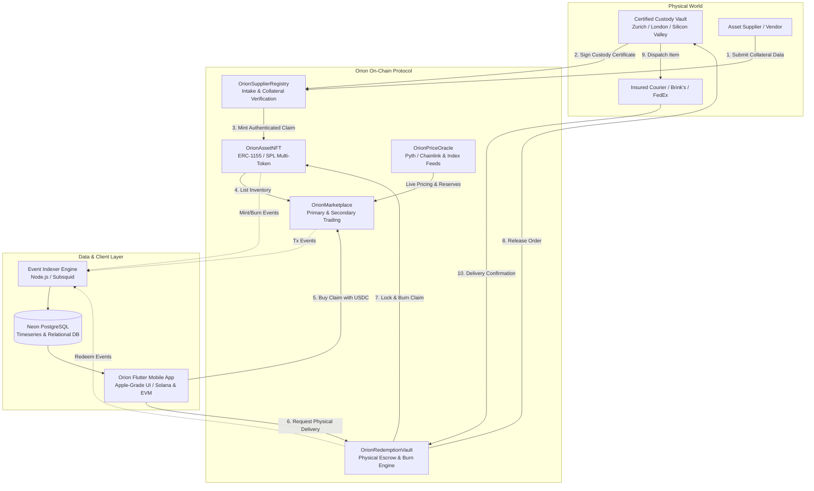
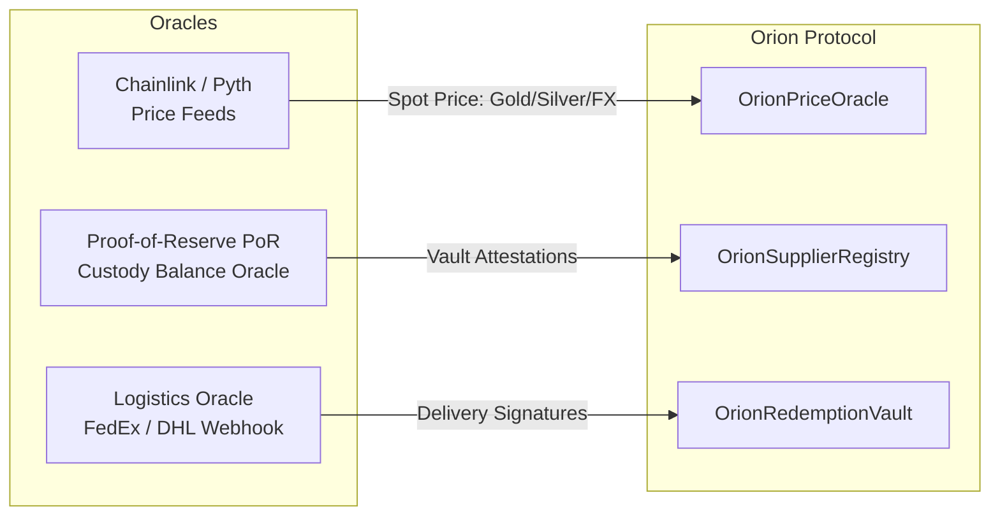
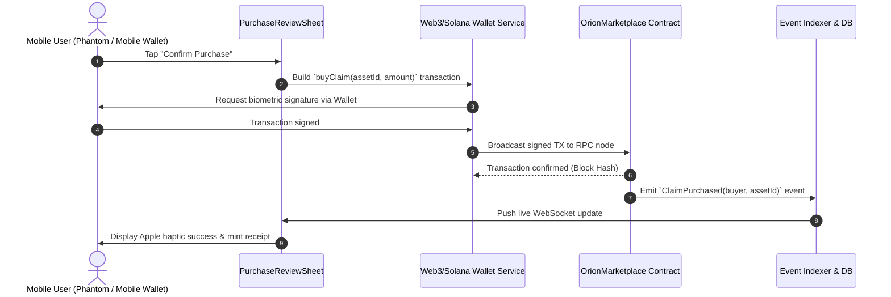

# Orion RWA Protocol & Marketplace

> **Enterprise-Grade Real-World Asset (RWA) Tokenization, Custodial Escrow & Liquidity Protocol**  
> Orion bridges high-value physical inventory—such as enterprise AI compute, certified bullion, sealed consumer electronics, datacenter components, and tokenized autonomous fleets—into liquid, composable, and legally enforceable on-chain digital claims.

---

## Table of Contents
1. [Executive Protocol Architecture](#1-executive-protocol-architecture)
2. [Target Asset Classes & Physical Backing](#2-target-asset-classes--physical-backing)
3. [Smart Contracts Architecture & Specifications](#3-smart-contracts-architecture--specifications)
   - [3.1 OrionAssetNFT (RWA Claim Token)](#31-orionassetnft-rwa-claim-token)
   - [3.2 OrionMarketplace (Primary & Secondary Exchange)](#32-orionmarketplace-primary--secondary-exchange)
   - [3.3 OrionRedemptionVault (Physical Delivery & Burn-on-Delivery)](#33-orionredemptionvault-physical-delivery--burn-on-delivery)
   - [3.4 OrionSupplierRegistry (Intake, Verification & Whitelisting)](#34-orionsupplierregistry-intake-verification--whitelisting)
   - [3.5 OrionPriceOracle (Valuation & Price Aggregation)](#35-orionpriceoracle-valuation--price-aggregation)
4. [Oracle Design & Creation Architecture](#4-oracle-design--creation-architecture)
   - [4.1 Valuation & Spot Price Oracles (Chainlink & Pyth)](#41-valuation--spot-price-oracles-chainlink--pyth)
   - [4.2 Proof-of-Reserve (PoR) & Vault Custody Oracle](#42-proof-of-reserve-por--vault-custody-oracle)
   - [4.3 Logistics & Delivery Settlement Oracle](#43-logistics--delivery-settlement-oracle)
5. [Contracts Directory & Deployment Setup](#5-contracts-directory--deployment-setup)
   - [5.1 Directory Layout](#51-directory-layout)
   - [5.2 Deployment & Verification Pipeline](#52-deployment--verification-pipeline)
6. [Data Pipeline: Transitioning from Demo to Production](#6-data-pipeline-transitioning-from-demo-to-production)
   - [6.1 Relational Database Schema (Neon PostgreSQL)](#61-relational-database-schema-neon-postgresql)
   - [6.2 On-Chain Event Indexer Service](#62-on-chain-event-indexer-service)
7. [Flutter Mobile App Integration Map](#7-flutter-mobile-app-integration-map)
   - [7.1 Screen & Feature to Contract Mapping](#71-screen--feature-to-contract-mapping)
   - [7.2 Transaction Lifecycle in the Mobile Client](#72-transaction-lifecycle-in-the-mobile-client)
8. [Phased Implementation Roadmap](#8-phased-implementation-roadmap)

---

## 1. Executive Protocol Architecture

Orion converts audited physical collateral stored in secure vaults into on-chain digital claim tokens. Users can trade, fractionalize, borrow against, or physically redeem these assets on demand.



---

## 2. Target Asset Classes & Physical Backing

Orion supports five core asset tiers represented in the mobile marketplace:

| Asset Class | Example Asset | Backing Custody Standard | Unit Tokenization Model |
| :--- | :--- | :--- | :--- |
| **Enterprise AI Compute** | NVIDIA H100 SXM5 80GB | Tier-4 Datacenter (Silicon Valley) | Fungible cluster shares (e.g. 10,000 shares / node) |
| **Precious Metals** | 99.99% Fine Gold / Silver Bullion | Malca-Amit / Zurich Vault Custody | 1 Troy Ounce per Claim Token |
| **Consumer Hardware** | iPhone 15 Pro (Natural Titanium) | Sealed Grade A Vault Storage | 1:1 Non-Fungible Claim (IMEI-bound) |
| **Autonomous Vehicles** | Tesla Model S Plaid 2024 | Bonded Vehicle Facility | Tokenized Fleet Shares (VIN-bound) |
| **Datacenter Memory** | DDR5 32GB ECC Reg 6400 | Secure Component Depots | Bulk Batch Claims (LOT-bound) |

---

## 3. Smart Contracts Architecture & Specifications

### 3.1 `OrionAssetNFT` (RWA Claim Token)
* **Standard**: Multi-Token Standard (`ERC-1155` on EVM or `SPL Token-2022` on Solana) to support both unique 1-of-1 items and fractional/fungible lots.
* **Core Responsibilities**:
  - Implements cryptographically verifiable custody metadata for every asset.
  - Controls supply caps based on physical vault receipts.
  - Enforces a deterministic lifecycle:
    ```
    DRAFT_INTAKE ──> CUSTODY_AUDITED ──> TOKENIZED_ACTIVE ──> REDEMPTION_LOCKED ──> BURNED
    ```
* **Key On-Chain Fields**:
  - `uint256 assetId`: Unique identifier for the asset tier/batch.
  - `bytes32 serialHash`: SHA-256 hash of physical identifiers (IMEI, VIN, Bullion Bar serial).
  - `address custodian`: Certified vault address holding physical possession.
  - `uint8 conditionGrade`: Standardized grade enum (`SEALED_GRADE_A`, `ENTERPRISE_NEW`, `BULLION_9999`).
  - `string ipfsMetadataUri`: URI containing inspection photos, assay reports, and insurance certificates.
  - `bool isRedeemed`: Final burn/redeem flag preventing reuse.

---

### 3.2 `OrionMarketplace` (Primary & Secondary Exchange)
* **Standard**: Non-custodial settlement contract supporting direct sales and peer-to-peer secondary trading.
* **Core Responsibilities**:
  - **Settlement Currency**: Standard stablecoins (**USDC**) or wrapped native gas tokens.
  - **Protocol Fee Engine**: Deducts a 2.5% protocol fee from gross volume and routes it to the Orion Treasury DAO.
  - **Primary Sales**: Whitelisted suppliers list minted inventory at fixed or oracle-pegged prices.
  - **Secondary P2P Trading**: Users holding digital claims can list them on the secondary orderbook with instant, atomic execution.
  - **Price Slippage Protection**: Ensures orders execute within user-defined bounds.

---

### 3.3 `OrionRedemptionVault` (Physical Delivery & Burn-on-Delivery)
* **Standard**: Secure custody release and burn controller.
* **Core Responsibilities**:
  - Bridges the digital token to physical shipping.
  - When a user calls `requestRedemption(uint256 assetId, uint256 amount, bytes encryptedShippingDetails)`:
    1. The claim token is transferred from the user into the `OrionRedemptionVault` and locked.
    2. A unique `RedemptionTicket` is minted with status `PENDING_DISPATCH`.
    3. The vault custodian receives the encrypted shipping instructions, verifies physical packing, and dispatches the item.
    4. Upon verified delivery confirmation from the courier oracle, the locked claim token is permanently **burned**.
    5. In the event of delivery failure or customs rejection, the claim can be unlocked and returned to the user.

---

### 3.4 `OrionSupplierRegistry` (Intake, Verification & Whitelisting)
* **Standard**: Access control and collateral verification registry.
* **Core Responsibilities**:
  - Role-Based Access Control: `ADMIN_ROLE`, `SUPPLIER_ROLE`, `CUSTODIAN_ROLE`, `AUDITOR_ROLE`.
  - Powers the [supplier_wizard.dart](file:///d:/Yash/flutter_project/orion/lib/features/supplier/presentation/supplier_wizard.dart) flow:
    1. Supplier submits intake application with batch details, serial numbers, and condition grades.
    2. Certified custodian inspects physical goods upon receipt at the vault.
    3. Custodian co-signs the on-chain proposal.
    4. The registry authorizes `OrionAssetNFT` to mint corresponding claim tokens.

---

### 3.5 `OrionPriceOracle` (Valuation & Price Aggregation)
* **Standard**: Multi-source aggregator integrating decentralized price feeds.
* **Core Responsibilities**:
  - Returns USD spot valuations for portfolio calculations, chart sparklines, and slippage checks.
  - Includes circuit breakers: rejects stale price updates if heartbeat exceeds maximum tolerances.

---

## 4. Oracle Design & Creation Architecture

Because RWAs exist off-chain, Orion requires three dedicated oracle layers:



### 4.1 Valuation & Spot Price Oracles (Chainlink & Pyth)
* **Commodities (Gold & Silver)**:
  - Consumes Chainlink Aggregator feeds (`XAU / USD` and `XAG / USD`) or Pyth Network price accounts.
  - Low-latency, sub-second updates feed the portfolio valuation chart.
* **Hardware & Compute (NVIDIA H100, iPhones, Datacenter Components)**:
  - Custom Oracle feed using **Chainlink Functions**:
  - Queries certified secondary market APIs, GPU rental indexes (RunPod, Lambda Labs), and wholesale hardware market indexes.
  - Pushes median benchmark pricing on-chain daily or upon $> 2\%$ volatility.

### 4.2 Proof-of-Reserve (PoR) & Vault Custody Oracle
* Periodic automated audit feeds published by certified vault partners (e.g., Malca-Amit, Loomis, Brink's).
* The oracle verifies:
  $$\text{Vault Verified Units} \ge \text{Total On-Chain Supply}$$
* If physical reserves fall below tokenized supply (e.g., during transit or damage), minting is paused automatically.

### 4.3 Logistics & Delivery Settlement Oracle
* Integrates shipping couriers (FedEx API, DHL Express, Brink's Secure Logistics).
* Custodians dispatch shipments with a registered tracking number and receiver hash.
* Chainlink Functions queries courier delivery endpoints. Once marked `DELIVERED` with recipient signature verification, an automated transaction triggers `completeRedemptionAndBurn()`.

---

## 5. Contracts Directory & Deployment Setup

### 5.1 Directory Layout

The `contracts/` directory contains complete smart contracts, configuration, test suites, and deployment scripts:

```
orion/
├── contracts/
│   ├── contracts/
│   │   ├── tokens/
│   │   │   ├── OrionAssetNFT.sol          # Multi-asset RWA custody claim token
│   │   │   └── OrionMockUSDC.sol          # Testnet USDC token for trading
│   │   ├── core/
│   │   │   ├── OrionMarketplace.sol       # Primary sales, P2P secondary trading, 2.5% fee
│   │   │   ├── OrionRedemptionVault.sol   # Physical asset redemption & burn-on-delivery
│   │   │   └── OrionSupplierRegistry.sol  # Supplier KYC, intake proposals & auditor approvals
│   │   ├── oracles/
│   │   │   ├── OrionPriceOracle.sol       # Chainlink / Pyth price feed aggregator
│   │   │   └── MockV3Aggregator.sol       # Local testing oracle for Gold/Silver/Hardware
│   │   └── interfaces/
│   │       ├── IOrionAssetNFT.sol
│   │       ├── IOrionMarketplace.sol
│   │       ├── IOrionRedemptionVault.sol
│   │       └── AggregatorV3Interface.sol
│   ├── scripts/
│   │   ├── deploy.js                      # Full deployment & role configuration script
│   │   ├── seed_assets.js                 # Mint initial RWAs (H100, Gold, iPhone, Tesla, RAM)
│   │   └── update_oracle.js               # Script to push live price updates
│   ├── test/
│   │   ├── OrionMarketplace.test.js       # Test purchasing, fees, secondary trades
│   │   ├── OrionRedemptionVault.test.js   # Test physical redemption & burn lifecycle
│   │   └── OrionPriceOracle.test.js       # Test price feeds & valuations
│   ├── hardhat.config.js                  # Network configurations (Local, Base Sepolia, etc.)
│   ├── package.json                       # Dependencies (@openzeppelin/contracts, hardhat, etc.)
│   └── .env.example                       # RPC URLs, Private Keys, Etherscan/API keys
```

### 5.2 Deployment & Verification Pipeline

1. **Install Dependencies**:
   ```bash
   cd contracts
   npm install
   ```

2. **Configure Environment Variables** in `.env`:
   ```env
   PRIVATE_KEY=0x...
   RPC_URL=https://sepolia.base.org
   TREASURY_ADDRESS=0x...
   ETHERSCAN_API_KEY=...
   ```

3. **Run Automated Test Suite**:
   ```bash
   npx hardhat test
   ```

4. **Deploy to Testnet**:
   ```bash
   npx hardhat run scripts/deploy.js --network baseSepolia
   ```

5. **Seed Demo Assets**:
   ```bash
   npx hardhat run scripts/seed_assets.js --network baseSepolia
   ```

---

## 6. Data Pipeline: Transitioning from Demo to Production

The app currently uses in-memory mock datasets in [mock_inventory.dart](file:///d:/Yash/flutter_project/orion/lib/features/marketplace/data/mock_inventory.dart) and [portfolio_data.dart](file:///d:/Yash/flutter_project/orion/lib/features/home/models/portfolio_data.dart). The production architecture replaces these mocks with an event-driven database and indexing engine:

### 6.1 Relational Database Schema (Neon PostgreSQL)

```sql
-- 1. Asset Registry
CREATE TABLE assets (
    id SERIAL PRIMARY KEY,
    token_id NUMERIC NOT NULL UNIQUE,
    name VARCHAR(255) NOT NULL,
    symbol VARCHAR(50) NOT NULL,
    category VARCHAR(50) NOT NULL,
    grade VARCHAR(100) NOT NULL,
    specification TEXT NOT NULL,
    identifier VARCHAR(100) NOT NULL,
    custodian_id VARCHAR(100) NOT NULL,
    vault_location VARCHAR(255) NOT NULL,
    price_usd NUMERIC(18, 4) NOT NULL,
    change_24h NUMERIC(6, 2) DEFAULT 0.0,
    total_supply NUMERIC(18, 0) NOT NULL,
    available_supply NUMERIC(18, 0) NOT NULL,
    image_uri VARCHAR(512),
    created_at TIMESTAMP WITH TIME ZONE DEFAULT NOW()
);

-- 2. User Owned Claims (Reflects on-chain holdings)
CREATE TABLE user_claims (
    id SERIAL PRIMARY KEY,
    owner_address VARCHAR(66) NOT NULL,
    asset_id INTEGER REFERENCES assets(id),
    amount NUMERIC(18, 0) NOT NULL DEFAULT 1,
    status VARCHAR(50) NOT NULL DEFAULT 'HELD', -- 'HELD', 'LISTED', 'REDEMPTION_REQUESTED', 'REDEEMED'
    acquired_price_usd NUMERIC(18, 4) NOT NULL,
    acquired_at TIMESTAMP WITH TIME ZONE DEFAULT NOW(),
    tx_hash VARCHAR(128) NOT NULL
);

-- 3. Historical Price Points (Feeds Portfolio & Sparkline Charts)
CREATE TABLE asset_price_history (
    id BIGSERIAL PRIMARY KEY,
    asset_id INTEGER REFERENCES assets(id),
    timestamp TIMESTAMP WITH TIME ZONE NOT NULL,
    price_usd NUMERIC(18, 4) NOT NULL
);
CREATE INDEX idx_price_history ON asset_price_history(asset_id, timestamp);

-- 4. Physical Redemption Tickets
CREATE TABLE redemption_tickets (
    ticket_id NUMERIC PRIMARY KEY,
    claim_id INTEGER REFERENCES user_claims(id),
    redeemer_address VARCHAR(66) NOT NULL,
    carrier VARCHAR(100),
    tracking_number VARCHAR(100),
    delivery_status VARCHAR(50) NOT NULL DEFAULT 'PENDING',
    created_at TIMESTAMP WITH TIME ZONE DEFAULT NOW(),
    delivered_at TIMESTAMP WITH TIME ZONE
);
```

### 6.2 On-Chain Event Indexer Service
A lightweight Node.js/Go daemon connects to the blockchain RPC websocket and listens for events:
* `event AssetMinted(uint256 indexed assetId, uint256 supply, string uri)` $\to$ Inserts new listing into `assets`.
* `event ClaimPurchased(address indexed buyer, uint256 assetId, uint256 price)` $\to$ Updates `user_claims` and recalculates 24h volume.
* `event RedemptionRequested(uint256 ticketId, address redeemer, uint256 assetId)` $\to$ Creates entry in `redemption_tickets`.
* `event ClaimBurned(uint256 assetId, uint256 ticketId)` $\to$ Marks claim as `REDEEMED`.

---

## 7. Flutter Mobile App Integration Map

### 7.1 Screen & Feature to Contract Mapping

| Screen / Feature | Current Mock Implementation | Production Contract / API Call |
| :--- | :--- | :--- |
| **Home Screen** ([home_screen.dart](file:///d:/Yash/flutter_project/orion/lib/features/home/presentation/home_screen.dart)) | [portfolio_data.dart](file:///d:/Yash/flutter_project/orion/lib/features/home/models/portfolio_data.dart) hardcoded points | Queries `GET /api/portfolio/{address}` & live RPC balance |
| **Marketplace** ([marketplace_screen.dart](file:///d:/Yash/flutter_project/orion/lib/features/marketplace/presentation/marketplace_screen.dart)) | [mock_inventory.dart](file:///d:/Yash/flutter_project/orion/lib/features/marketplace/data/mock_inventory.dart) static list | Queries `GET /api/assets` indexed from `OrionAssetNFT` |
| **Purchase Review** ([purchase_review_sheet.dart](file:///d:/Yash/flutter_project/orion/lib/features/marketplace/presentation/purchase_review_sheet.dart)) | Mock dialog confirmation | Signs `USDC.approve` + calls `OrionMarketplace.buyPrimaryClaim` |
| **Claims & Holdings** ([claims_screen.dart](file:///d:/Yash/flutter_project/orion/lib/features/portfolio/presentation/claims_screen.dart)) | Local state `List<OwnedClaim>` | Queries `OrionAssetNFT.balanceOf(walletAddress)` via RPC |
| **Physical Redemption** ([redemption_dialog.dart](file:///d:/Yash/flutter_project/orion/lib/features/portfolio/presentation/redemption_dialog.dart)) | Visual status toggle | Calls `OrionRedemptionVault.requestRedemption(...)` |
| **Supplier Intake** ([supplier_wizard.dart](file:///d:/Yash/flutter_project/orion/lib/features/supplier/presentation/supplier_wizard.dart)) | Mock 3-step submission | Calls `OrionSupplierRegistry.submitIntakeProposal(...)` |
| **Trade & Swap** ([trade_screen.dart](file:///d:/Yash/flutter_project/orion/lib/features/trade/presentation/trade_screen.dart)) | Simulated conversion rates | Calls `OrionMarketplace.swapTokens` or AMM pool |

### 7.2 Transaction Lifecycle in the Mobile Client



---

## 8. Phased Implementation Roadmap

1. **Phase 1: Smart Contracts & Oracles Core**
   - Write `OrionAssetNFT.sol`, `OrionMarketplace.sol`, `OrionRedemptionVault.sol`, `OrionSupplierRegistry.sol`, and `OrionPriceOracle.sol`.
   - Implement OpenZeppelin v5 security primitives (`ReentrancyGuard`, `Pausable`, `AccessControl`).
2. **Phase 2: Automated Testing & Verification**
   - Author Hardhat unit tests validating fee distribution, escrow locking, courier delivery burn, and oracle circuit breakers.
3. **Phase 3: Testnet Deployment & Asset Seeding**
   - Deploy contracts to Base Sepolia / Solana Devnet.
   - Seed default assets (H100 GPU cluster shares, Zurich Gold Bullion, iPhone 15 Pro, Tesla Model S, DDR5 RAM).
4. **Phase 4: Database & Event Indexer Setup**
   - Deploy Neon PostgreSQL tables.
   - Run the real-time RPC indexer daemon to synchronize contract events into queryable REST/WebSocket APIs.
5. **Phase 5: Mobile App Wiring**
   - Replace `mock_inventory.dart` and `portfolio_data.dart` with repository classes querying the live indexer and RPC nodes.
   - Connect `purchase_review_sheet.dart` to initiate real wallet transactions.
